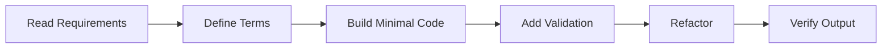

# Detailed Lecture Notes - Lesson 0.1: Developer Environment Setup

## Lesson Context
- Module: Foundations and Setup (Week 1)
- Primary topics: Install JDK (LTS), IntelliJ IDEA/VS Code, Maven and Gradle; Configure Git, GitHub, terminal workflows; Project structure conventions for Java and full-stack repos
- Target output: Local dev environment checklist complete
- Pace: Slow and incremental, with validation after each step

## Learning Objectives
1. Understand all core terms before coding.
2. Build one working path from input to output.
3. Add validation and error handling.
4. Refactor for readability and maintainability.
5. Explain the solution as if teaching a beginner.

## First-Time Terms and Definitions
- **Install JDK**: Install JDK is a key concept in this lesson.
- **LTS**: LTS is a key concept in this lesson.
- **IntelliJ IDEA**: IntelliJ IDEA is a key concept in this lesson.
- **VS Code**: VS Code is a key concept in this lesson.
- **Maven**: Maven is a key concept in this lesson.
- **Gradle**: Gradle is a key concept in this lesson.
- **Configure Git**: Configure Git is a key concept in this lesson.
- **GitHub**: GitHub is a key concept in this lesson.
- **terminal workflows**: terminal workflows is a key concept in this lesson.
- **Project structure conventions for Java**: Project structure conventions for Java is a key concept in this lesson.

## Slow-Paced Teaching Flow
1. Concept brief (what and why)
- Explain the problem in plain language.
- Identify inputs, transformations, and outputs.
2. Minimal implementation
- Implement the smallest working solution.
- Run immediately and inspect output.
3. Validation layer
- Add constraints and handle invalid states.
- Re-run and verify behavior with edge cases.
4. Professional improvement
- Extract methods, clarify names, remove duplication.
- Add comments only where logic is non-obvious.
5. Reflection
- Summarize trade-offs and next improvements.

## Annotated Demonstration
```java
public class LessonDemo {
    public static void main(String[] args) {
        // Step 1: Start from explicit input values
        String raw = "lesson-input";

        // Step 2: Validate early to keep behavior safe
        if (raw == null || raw.isBlank()) {
            System.out.println("Invalid input");
            return;
        }

        // Step 3: Apply core lesson transformation
        String result = raw.trim().toUpperCase();

        // Step 4: Produce deterministic output
        System.out.println("Output: " + result);
    }
}
```

## Concept Diagram


## Practice Checklist
- [ ] I can explain each term without notes.
- [ ] I ran the demo code and changed one behavior.
- [ ] I added one validation case and tested it.
- [ ] I can explain how this lesson supports full-stack development.
