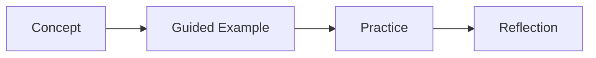

# Lesson 6.2 Lecture Notes: JWT and OAuth2/OIDC

## Context
- Module: Module 6 - Security and Identity (Weeks 17-18)
- Lesson focus: Token lifecycle, claims, refresh flow; Integrating external identity providers
- Expected output: OAuth2 login + JWT secured APIs

## Learning Objectives
- Understand the main ideas in this lesson in plain language.
- Practice each concept through incremental coding steps.
- Build confidence by validating results at every step.
- Produce the expected lesson output with clean, readable code.

## Terms You Meet First in This Lesson
- **Token lifecycle**: Token lifecycle is a key concept in this lesson. You will define it through examples and guided practice.
- **claims**: claims is a key concept in this lesson. You will define it through examples and guided practice.
- **refresh flow**: refresh flow is a key concept in this lesson. You will define it through examples and guided practice.
- **Integrating external identity providers**: Integrating external identity providers is a key concept in this lesson. You will define it through examples and guided practice.

## Slow-Paced Lecture Flow
1. Start by defining each important term before writing code.
2. Walk through one small example from input to output.
3. Explain why the example works and where beginners get stuck.
4. Extend the example with one practical variation.
5. Summarize decision points and trade-offs.

## Key Diagram


## Guided Code Walkthrough
Start with this minimal file, run it, then add behavior one small step at a time.

```java
/**
 * Lesson 6.2 sample starter.
 * Replace TODO blocks during guided practice.
 */
public class LessonSample {
    public static void main(String[] args) {
        String lesson = "JWT and OAuth2/OIDC";
        System.out.println("Running lesson: " + lesson);

        // TODO: Add lesson-specific logic step by step.
        // Keep each change small and verify output after every step.
    }
}
```

## Professional Notes
- Prefer clear naming over clever shortcuts.
- Validate assumptions with small tests or quick manual checks.
- Keep commits small so each change is easy to review.

## Checkpoint Questions
1. Can you explain each term in your own words?
2. Can you run the sample and change one behavior safely?
3. Can you describe one real-world use case of this lesson?
