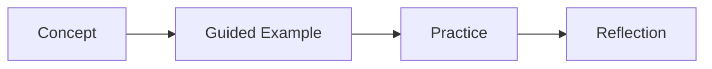

# Lesson 8.2 Lecture Notes: CI/CD Pipelines

## Context
- Module: Module 8 - DevOps and Platform Engineering (Weeks 21-24)
- Lesson focus: Build, test, lint, security scan, artifact publishing; GitHub Actions/Jenkins pipeline structure
- Expected output: Automated pipeline with quality gates

## Learning Objectives
- Understand the main ideas in this lesson in plain language.
- Practice each concept through incremental coding steps.
- Build confidence by validating results at every step.
- Produce the expected lesson output with clean, readable code.

## Terms You Meet First in This Lesson
- **Build**: Build is a key concept in this lesson. You will define it through examples and guided practice.
- **test**: test is a key concept in this lesson. You will define it through examples and guided practice.
- **lint**: lint is a key concept in this lesson. You will define it through examples and guided practice.
- **security scan**: security scan is a key concept in this lesson. You will define it through examples and guided practice.
- **artifact publishing**: artifact publishing is a key concept in this lesson. You will define it through examples and guided practice.
- **GitHub Actions**: GitHub Actions is a key concept in this lesson. You will define it through examples and guided practice.
- **Jenkins pipeline structure**: Jenkins pipeline structure is a key concept in this lesson. You will define it through examples and guided practice.

## Slow-Paced Lecture Flow
1. Start by defining each important term before writing code.
2. Walk through one small example from input to output.
3. Explain why the example works and where beginners get stuck.
4. Extend the example with one practical variation.
5. Summarize decision points and trade-offs.

## Key Diagram


## Guided Code Walkthrough
Start with this minimal file, run it, then add behavior one small step at a time.

```java
/**
 * Lesson 8.2 sample starter.
 * Replace TODO blocks during guided practice.
 */
public class LessonSample {
    public static void main(String[] args) {
        String lesson = "CI/CD Pipelines";
        System.out.println("Running lesson: " + lesson);

        // TODO: Add lesson-specific logic step by step.
        // Keep each change small and verify output after every step.
    }
}
```

## Professional Notes
- Prefer clear naming over clever shortcuts.
- Validate assumptions with small tests or quick manual checks.
- Keep commits small so each change is easy to review.

## Checkpoint Questions
1. Can you explain each term in your own words?
2. Can you run the sample and change one behavior safely?
3. Can you describe one real-world use case of this lesson?
